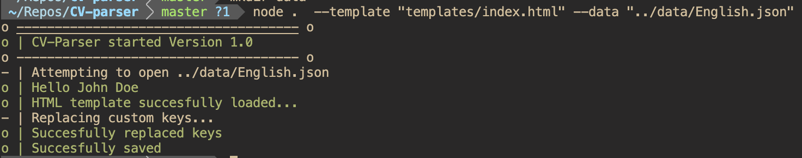
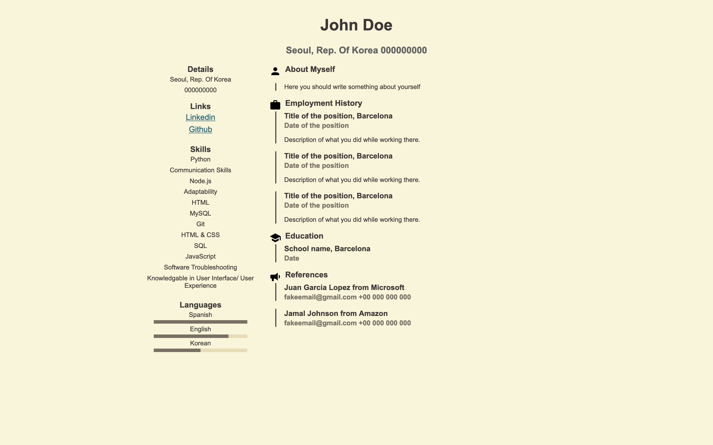

# CV-parser


CV-parser is a simple and lightweight cli application that helps you compile different variations of the same Curriculum Vitae / Resumé with ease.

It is very easy to work with since you just need to provide 2 different files that can be easily edited with any text editor.
You will need:

   - JSON file that contains the data that you want to populate your resume with.
   - Template file written in basic HTML that has the same variables that you specified in the JSON file. 

After running CV-parser and specifying such files; the application will replace the keys in the template with the corresponding data.

# Why is this useful?

Well it is useful in my case for 2 specific reasons:
1. I don't like using word processors. They get messy and I find way easier to customize and edit a HTML + CSS file. ( It is also free to use )
2. I have to generate different variations of the same CV ofent and editing is way easier with a text/code editor. I am multilingual so I will have to create several versions of the same curriculum.

# How to use:

First of all you will need to have [nodeJS](https://nodejs.org/en/) installed in your machine.

Then just clone this repository:
```bash
$ git clone https://github.com/Ryuu22/CV-parser.git
```

Change directory into the repository

```bash
$ node .  --template "templates/index.html" --data "../data/English.json"              
```
If everything went correctly the terminal should output the following lines:
            

This creates a file in the directory ```output``` called CV.html.

**Beware** that if the template depends on CSS or images, you must manually move them to the output directory.

Using the default template and Data file will produce the following result.

You can save this as PDF by printing the website in your browser.

Now you can modify the data and template files as you need and regenerate the template to see its changes.

You can change the default save location and filename by added the ```--out``` flag in the command line.

```bash
$ node .  --template "templates/index.html" --data "../data/English.json" --out "output/mycv.html"             
```

**protip:** Use nodemon to work while editing your template. Nodemon will rerun the app everytime you save a file in your project so you don't have to do it manually.


# Future improvements

- [ ] Data file generator. ( Small companion application in pure JS and HTML that generates a JSON data file )
- [ ] Add more templates.

- [ ] Automatically save to PDF

